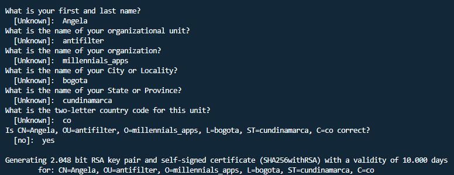

# antifilter_app

A new Flutter project.

## Getting Started

This project is a starting point for a Flutter application.

A few resources to get you started if this is your first Flutter project:

- [Lab: Write your first Flutter app](https://docs.flutter.dev/get-started/codelab)
- [Cookbook: Useful Flutter samples](https://docs.flutter.dev/cookbook)

For help getting started with Flutter development, view the
[online documentation](https://docs.flutter.dev/), which offers tutorials,
samples, guidance on mobile development, and a full API reference.

## Key Android

### Release (Create a keystore)

#### On Mac/Linux, use the following command:
```bash
keytool -genkey -v -keystore ~/key.jks -keyalg RSA -keysize 2048 -validity 10000 -alias mife_android_release_key
```
#### On Windows, use the following command:
```bash
keytool -genkey -v -keystore c:\PROJECT_ANDROID\key\ANTIFILTER_KEY.jks -storetype JKS -keyalg RSA -keysize 2048 -validity 10000 -alias antifilter_android_release_key
```

#### Password: 1988Antifilter2025

#### View keystore details
```bash
keytool -list -v -keystore "c:\PROJECT_ANDROID\key\ANTIFILTER_KEY.jks" -alias antifilter_android_release_key
```


## Create logo

- https://romannurik.github.io/AndroidAssetStudio/icons-notification.html

## Create APK

#### key.properties (package android)
```bash
storePassword=1988Antifilter2025
keyPassword=1988Antifilter2025
keyAlias=antifilter_android_realese_key
storeFile=C:\\project_android\\key\\ANTIFILTER_ANDROID_RELEASE_KEY.jks
```

#### Build Android: 
```bash
flutter build appbundle --release
```
#### Build IOS: 
```bash
flutter build ipa --release
```

## Flutter Version
```bash
• Flutter version 3.32.5 on channel stable
• Upstream repository https://github.com/flutter/flutter.git
• Framework revision fcf2c11572 (3 weeks ago), 2025-06-24 11:44:07 -0700
• Engine revision dd93de6fb1
• Dart version 3.8.1
• DevTools version 2.45.1
```

## Android Studio
```bash
• Android Studio (version 2024.3.2)
• Android toolchain - develop for Android devices (Android SDK version 36.0.0)
• Platform android-36, build-tools 36.0.0
• Java version OpenJDK Runtime Environment (build 21.0.6+-13368085-b895.109)
```